# CloudOpsAI 

### AWS Cloud Operations & Intelligence Platform

CloudOpsAI is an AWS-only cloud operations command center designed to provide a unified view of AWS infrastructure health, performance, operational risks, optimization opportunities, notifications, and reports.

It connects to a real AWS environment through an authorized IAM role and uses temporary AWS STS credentials to inspect infrastructure without requiring long-lived AWS secret keys inside the application.

---

##  What CloudOpsAI Does

CloudOpsAI brings several operational capabilities into one command center:

-  Real-time EC2 infrastructure visibility

-  CloudWatch CPU and network monitoring

-  Infrastructure health scoring

-  Operational readiness scoring

-  Explainable anomaly and optimization analysis

-  Cost and savings estimation

-  AWS SNS email notifications

-  Infrastructure health reports

-  S3 report storage

-  Secure AWS IAM + STS integration

-  User authentication and session security

-  Operational activity logging

-  Interactive EC2 resource details

-  Dark / light interface

-  Responsive professional dashboard

---

#  Application Screenshots

## Landing Page

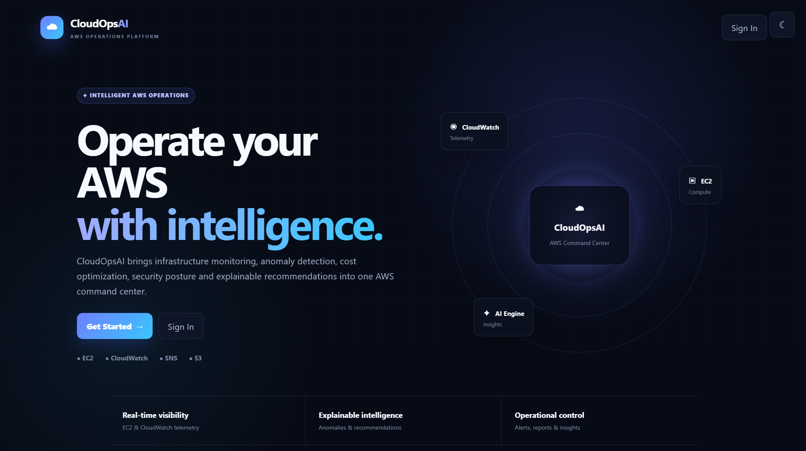

## Secure Account Registration

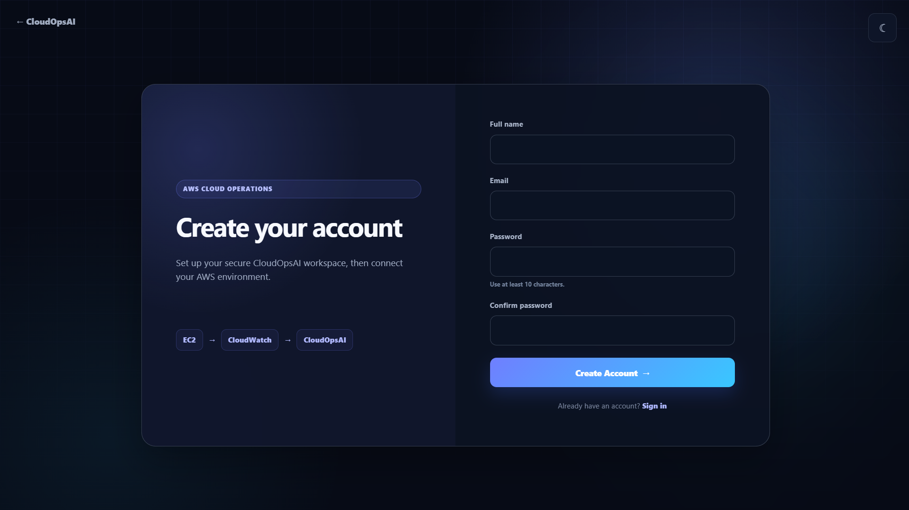

## AWS Connection

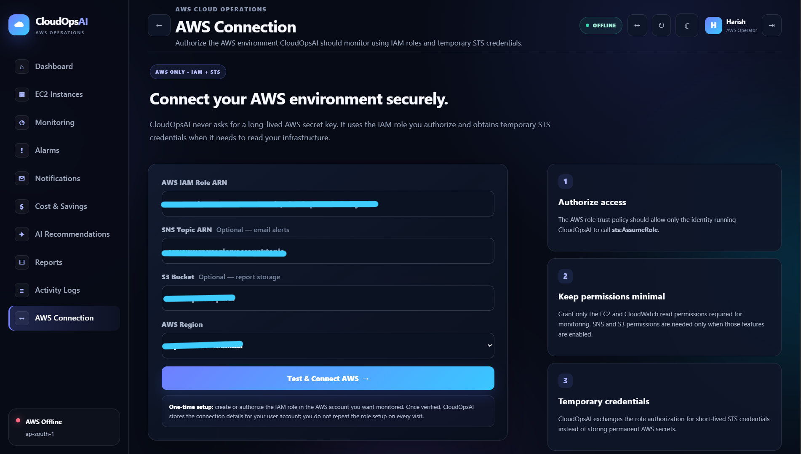

## Command Center Dashboard

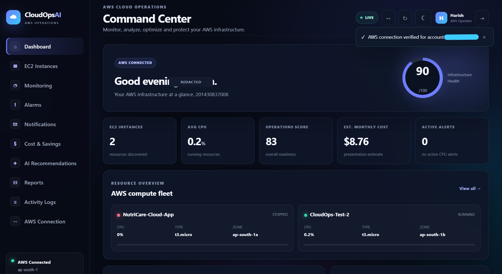

## EC2 Infrastructure

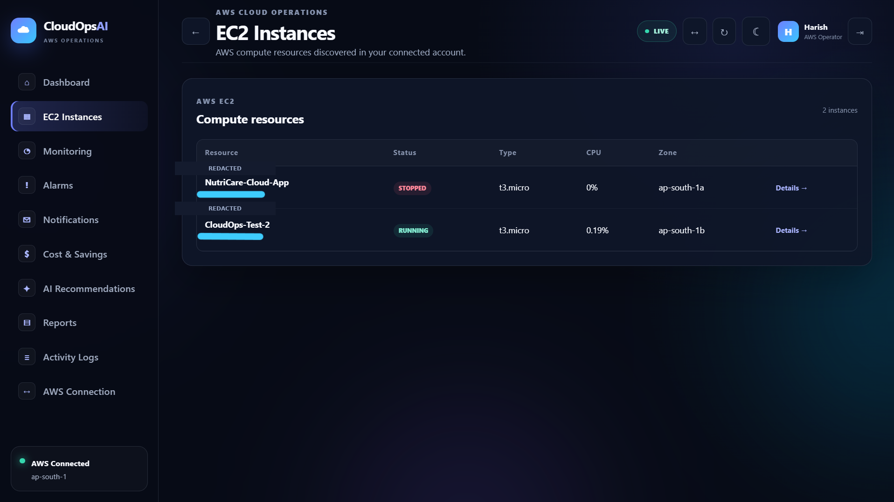

## CloudWatch Monitoring

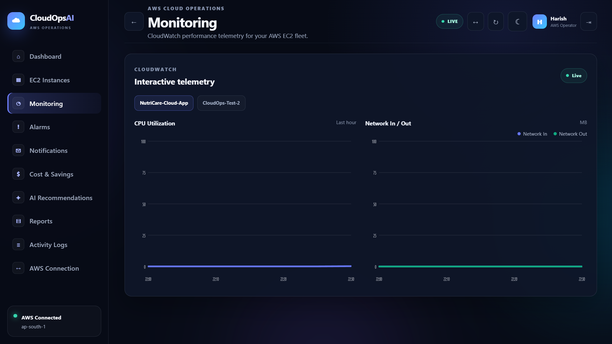

## AWS Notifications

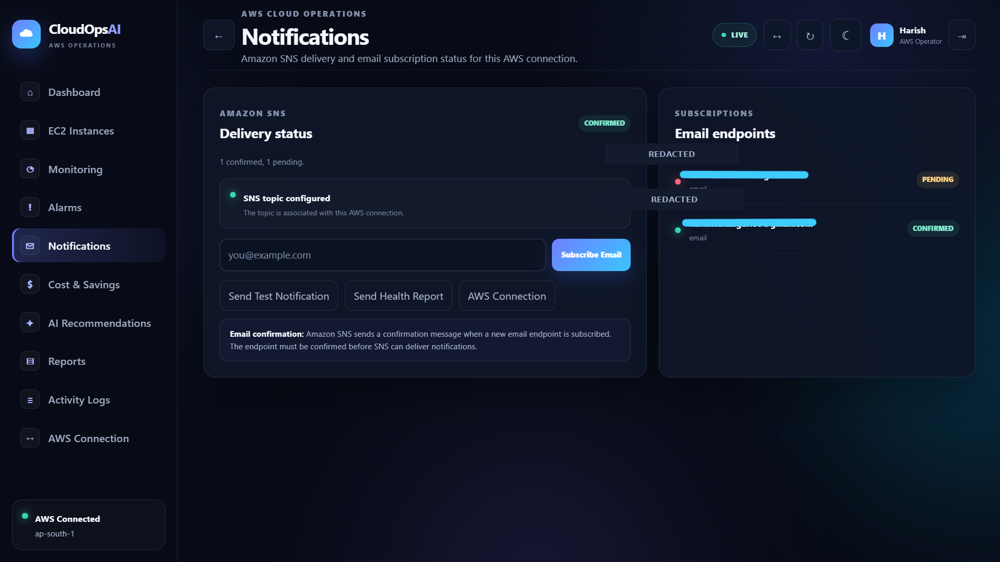

## Cost & Savings

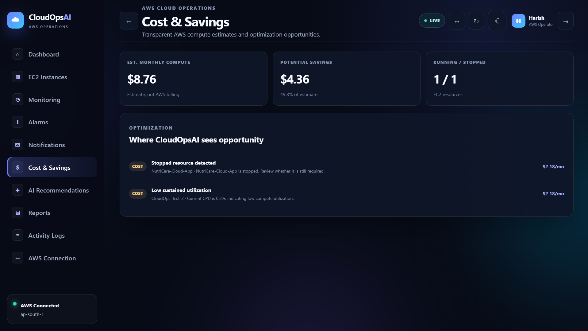

## AI Recommendations

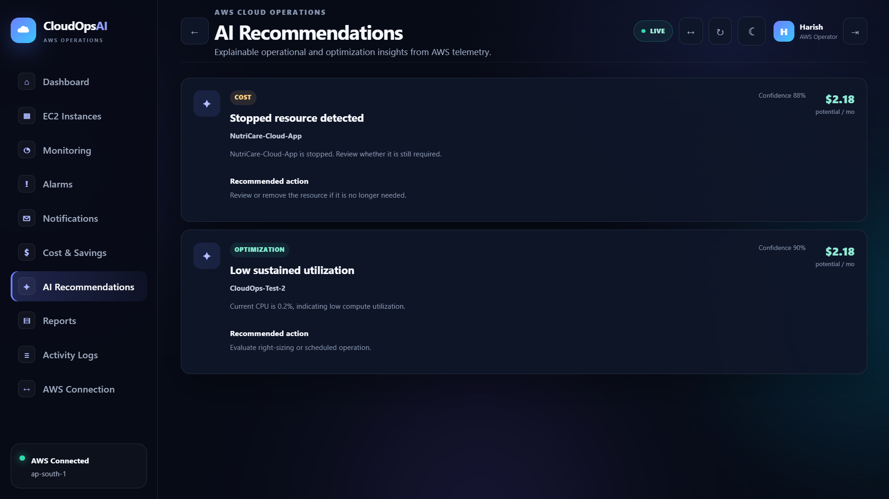

## Reports

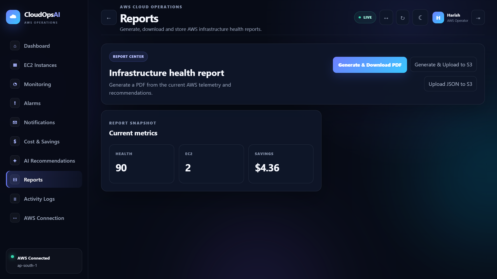

## Activity Logs

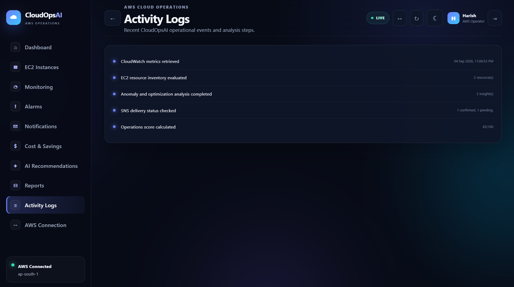

## Generated Infrastructure Report

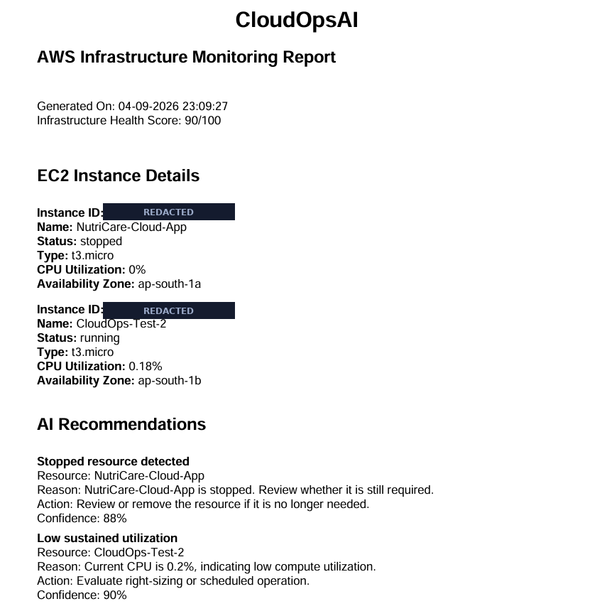

---

# Architecture

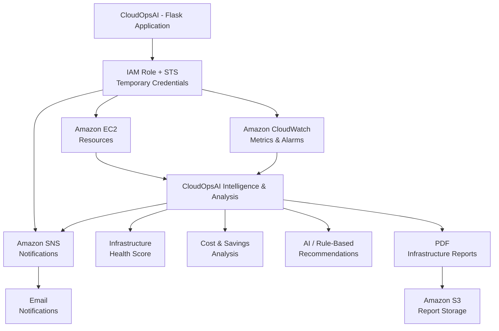

